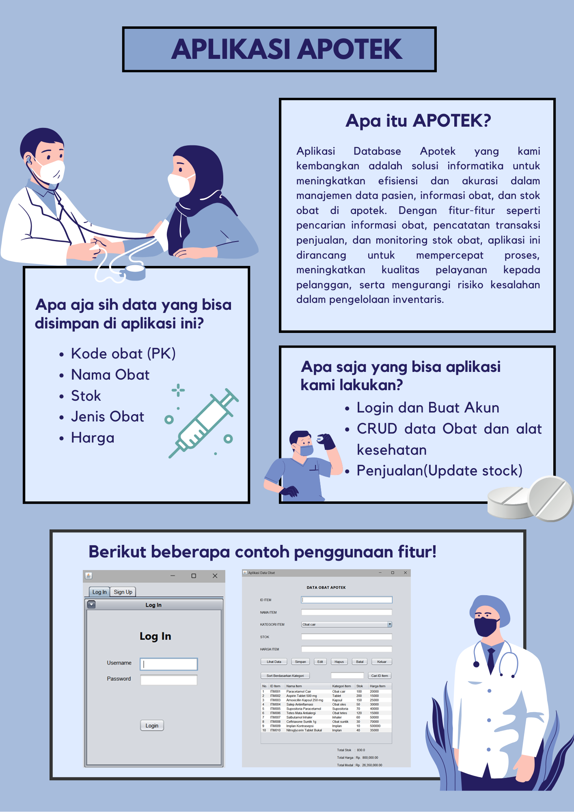

# Assurance of Learning - Object Oriented Programming

<h3><b>Anggota : </b></h3>
Davin Nayaka Pandya / 2602163336 
Nico Himawan / 2602060722 
Oditya Ridho Darmanto / 2602217225 
Steven Liu Sentiko / 2602081235 

 
<b>User Manual:</b> https://youtu.be/Dh8fxxjL3Ug  
<b>Google Drive:</b> https://drive.google.com/drive/folders/17RH9421da5SBlmYXdqzZKBCXHXDvGW8d?usp=sharing 
 

<h3>
<b>Tema :</b> Kesehatan 
<b>Judul:</b> Apotek 
<b>Fitur:</b>
</h3>

- Login dan Buat Akun
- CRUD data Obat dan alat kesehatan
- Penjualan (Update stock)

<h3>Tabel pada Database:</h3>

- Obat dan Alat Kesehatan (data_item)
    - Kode obat (PK)
    - Nama Obat
    - Stok
    - Jenis Obat
    - Harga

- Login dan Signup (userdata)
    -  Username
    -  Password
    -  Nama
    -  Status (Admin atau tidak)
    -  Tanggal Dibuat
